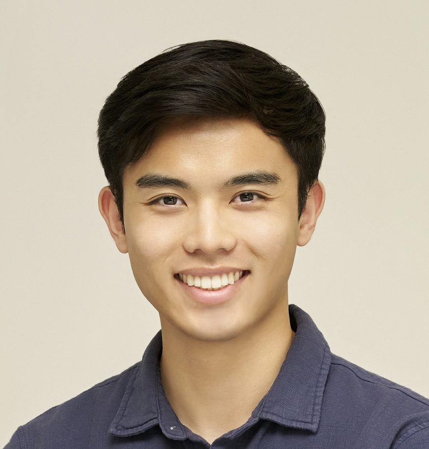

# About

{ .about-photo width="25%" }

I'm driven by a curiosity about what I am capable of. I'm inspired by people who are similarly motivated. 

I began my studies in Georgia Tech's Online Master of Science in Computer Science (OMSCS) program in the spring of 2026. After I swore off computer science in my freshman year of college and changed my major to electrical engineering, I'm back. How the tables have turned. I'm interested in using my talents and energy to shape a better world, and I believe a computer science education will help me achieve that. Before my interests shifted to building software, I executed an MBTA pilot project in my first job out of college to evaluate the feasibility of running license plate recognition cameras on public frequent-route buses. Now, at my second company, I am responsible for the software integration of a strategic radar. I move between Boston and Mountain View every other year for my work.

I also cycle and weight train regularly. I most recently completed the [Marin Double Metric Century (127 miles, 10,000+ft)](https://www.strava.com/activities/19562459563). Before cycling, I was an amateur runner who completed my first marathon in [under 3 hours](https://www.strava.com/activities/10981019147). Before that, I climbed plastic rocks in various warehouses around the Greatear Boston Area. I've dabbled in sports my entire life, and have no plans to stop anytime soon. I use my athletic hobbies to build relationships, practice listening to my body, and as another outlet to pursue growth.

I am proudly blazing my own trail. My parents came to the States in the late eighties and early nineties, having left rural Vietnam to pursue better opportunities in the U.S. As long as I can remember, life has been a continuous game of figuring things out. I walked onto the high school football team as a sophomore and ended my high school career having played up to a few varsity games and earning Most Improved Player. I became the first in my family to attend college, and graduated from Tufts. As a student, I helped organize culture club events and ran a few meetings as Vice President of the Vietnamese Students Club, participated in the marathon team and karate club, and even met Matt Damon at the school gym. Since then, I've switched jobs, fallen in and out of love, moved across the country, traveled the world, adopted a cat, and even contributed to my 401k. Yeah, there's a lot to be proud of.

I write to clarify my thoughts, share my interests, tell stories, and document my growth. I hope this website is a testament to that.