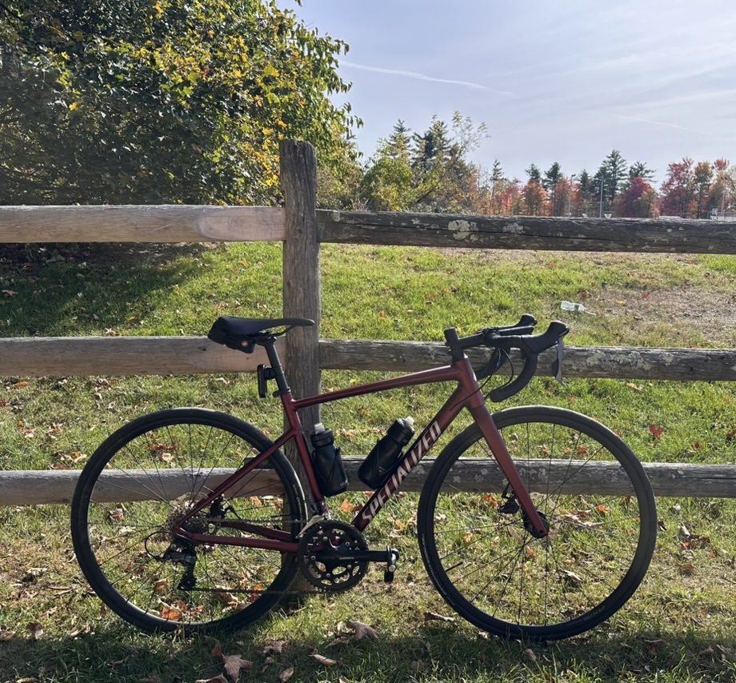

In December of 2025, I suffered a shin splint that would, unbeknownst to me, sideline me from running for several weeks. I had just run 17:08, my personal best in the 5k, and allowed myself rest one day before running a difficult tempo Tuesday workout with the Cambridge Running Club. 

The culprit was overuse - and luckily, a visit to the orthopedic specialist ruled out any fractures. I breathed a sigh of relief. The next day, I purchased an indoor trainer for my Specialized Allez. I had bought the road bike more than two summers ago, when I suffered my first injury as a budding-but-serious runner: patellofemoral pain syndrome. The Allez was an entry-level bike, but I knew my cycling foray would be short-lived. Ruby, as I had named her, and I traveled to several nearby towns that, until then, I had little reason to visit. We rolled over roads and enjoyed the verdant tranquility of the well-to-do Boston suburbs. Gradually, my knee pain subsided, and I found myself spending less time on the saddle and back to haunting Beacon St, Longfellow Bridge, the Esplanade, and Massachusetts Avenue in my stacked running shoes. My chapter with Ruby had come to a close, but I was glad that she and I had shared some enjoyable memories together. I was comforted by the knowledge that she and I would pick up where we left off, were I to return.

